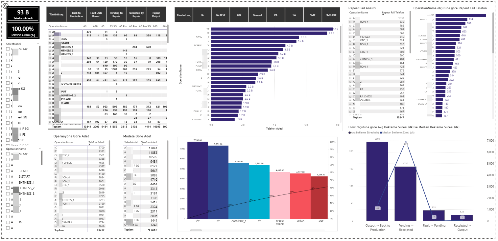

# 📱 Repair Operations & Quality Analytics Dashboard

This project provides a comprehensive look into technical service/production line efficiency. It focuses on identifying process bottlenecks and quality issues through data-driven insights.

## 🚀 Key Features & Visuals

### 1. General Overview & Filtering
The dashboard allows real-time filtering by **Sales Model** and **Operation Name**, providing a dynamic view of total phone counts and success rates.

### 2. Quality Control: Repeat Fail Analysis
Located in the top right, this section identifies operations with the highest re-occurrence of faults. 
* **Insight:** High repeat rates in specific operations (like `FUNCTION_4`) suggest a need for technician training or tool calibration.

### 3. Bottleneck Identification: Waiting Times (Flow)
The "Flow" chart at the bottom right analyzes the time spent between stages.
* **Key Finding:** There is a significant delay in the **"Output → Back to Production"** flow (avg. 6894 min), indicating a major bottleneck in the feedback loop.

### 4. Station Performance: Pareto Analysis
The Pareto chart helps prioritize which stations (ICT, BT, Cosmetic, etc.) are responsible for the majority of errors, allowing management to focus on the "vital few" problems.

## 🛠 Tools Used
* **Visualization:** Power BI (or Excel)
* **Analysis:** Pareto Analysis, Cycle Time Analysis, KPI Tracking
