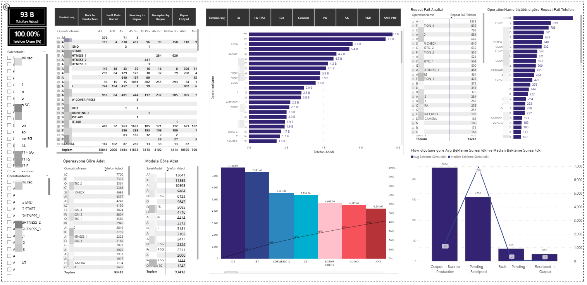

# 📱 Repair Operations & Quality Analytics Dashboard

## 📋 Proje Özeti
Bu proje, teknik servis ve üretim hattındaki operasyonel süreçleri optimize etmek amacıyla geliştirilmiş bir **Decision Support System (DSS)** çalışmasıdır. Veri analitiği yöntemleri kullanılarak; üretim hattındaki darboğazlar, kalite sapmaları ve teknisyen performansları incelenmiştir.

---

## 🛠 Analitik İş Akışı (Methodology)

Bir veri analisti perspektifiyle proje 4 ana aşamada tamamlanmıştır:

1. **Veri Hazırlama (ETL):** Ham üretim logları ve servis kayıtları temizlendi, tarih formatları standardize edildi ve eksik veriler (null values) ayıklandı.
2. **Metrik Tanımlama:** Verimliliği ölçmek için **Cycle Time**, **First Pass Yield (FPY)** ve **Repeat Fail Rate** gibi anahtar performans göstergeleri (KPI) hesaplandı.
3. **Keşifsel Veri Analizi (EDA):** İstasyon bazlı hata dağılımları incelenerek anomaliler tespit edildi.
4. **Görselleştirme & Storytelling:** Veriler, paydaşların hızlı aksiyon alabileceği interaktif bir dashboard'a dönüştürüldü.

---

## 🚀 Öne Çıkan Bulgular ve İçgörüler

### 1. Darboğaz Analizi (Cycle Time)
Analiz sonucunda, **"Output → Back to Production"** aşamasında ortalama **6894 dakikalık** bir bekleme süresi saptanmıştır. Bu durum sürecin en büyük darboğazıdır ve geri besleme döngüsünde (feedback loop) ciddi bir verimlilik kaybına işaret eder.

### 2. Pareto Analizi (Hata Önceliği)
Hataların büyük çoğunluğunun belirli istasyonlarda (ICT, BT, Cosmetic) yoğunlaştığı görülmüştür. Kaynakların bu "hayati azınlık" (vital few) üzerine odaklanmasıyla toplam hata oranında maksimum düşüş hedeflenmiştir.

### 3. Kalite Kontrol (Repeat Fail)
`FUNCTION_4` operasyonundaki yüksek tekrar (re-occurrence) oranları, tesadüfi hatalardan ziyade teknik bir yetersizliği veya yanlış kalibrasyonu işaret etmektedir.

---

## 📈 İş Etkisi (Business Impact)
* **Verimlilik:** Darboğaz tespiti ile onarım sürelerinde (MTTR) iyileştirme potansiyeli.
* **Maliyet:** Tekrar eden hataların önlenmesiyle parça ve işçilik maliyetlerinde tasarruf.
* **Eğitim:** Veri odaklı performans takibi ile hangi teknisyenlerin hangi alanlarda eğitime ihtiyaç duyduğunun belirlenmesi.

---

## 🧰 Teknik Araçlar
* **Veri Görselleştirme:** Power BI / Excel
* **Analiz Teknikleri:** Pareto Analizi, Çevrim Süresi Analizi, Kök Neden Analizi (RCA)
* **Fonksiyonlar:** Gelişmiş DAX hesaplamaları ve dinamik filtreleme.

---
**Hazırlayan:** [Nilay ÖZEL]  
**LinkedIn:** [https://www.linkedin.com/in/nilay-%C3%B6zel-2927a7210/]
